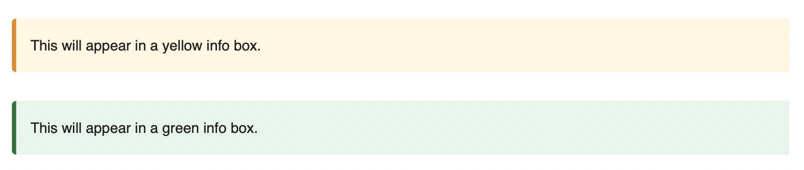

author: Iván Cabezón
summary: How to codelab
id: codelab_tutorial
tags: codelab
categories: Tutorial
environments: Web
status: Published
Feedback: https://nscabezon.com

# The codelab on how to codelab 😀

## Get claat

Duration: 00:01:30

There are different ways to get claat.

Option 1:

Downloading the binary from the releases of [google's tool page](https://github.com/googlecodelabs/tools)

Once we downloaded claat we can move it to the `bin` directory or directly use it in the same dir as the codelab we are going to create.

Option 2: 

Install it with go, with the following command:

```
go install github.com/googlecodelabs/tools/claat@latest
```

Then you'll need to export the paths:

```
export GOPATH=$HOME/Go
export GOROOT=/usr/local/opt/go/libexec
export PATH=$PATH:$GOPATH/bin
export PATH=$PATH:$GOROOT/bin
```

To make sure claat is installed properly we can type `claat` into the terminal.


## Create a md file

Duration: 00:03:00

First thing we need to do is create a md file. Then modify it with the contents we want to have.

The title can be set with one number sign `#`.

Each headline marked with two number signs `##` will be a step in our codelab.

Right under each step we can put a duration for each step. Ex, for one min it will look like this:

```
Duration: 00:01:00
```

We can also add info boxes.



For the info we have to note like this:

```
Negative
: This will appear in a yellow info box.
```

and for the green one:

```
Positive
: This will appear in a green info box.
```


## Generate codelab

Duration: 00:01:00

Once you have your codelab in place there's only one thing left and that is generate the html 😄.

Go to the dir in which you're working and run the following command:

```
claat export name_of_the_md_file_to_export
```